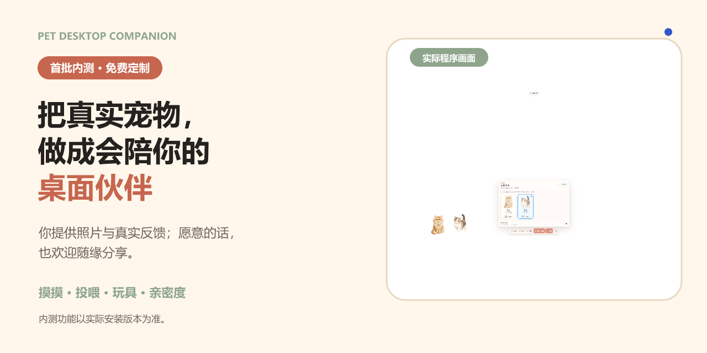
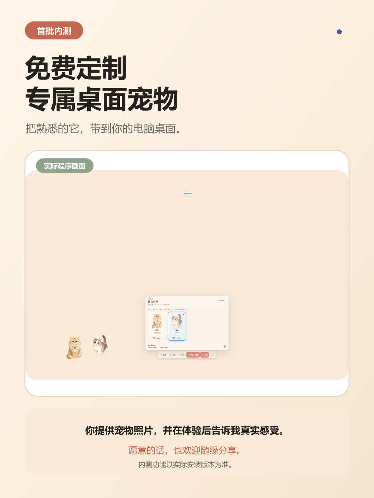
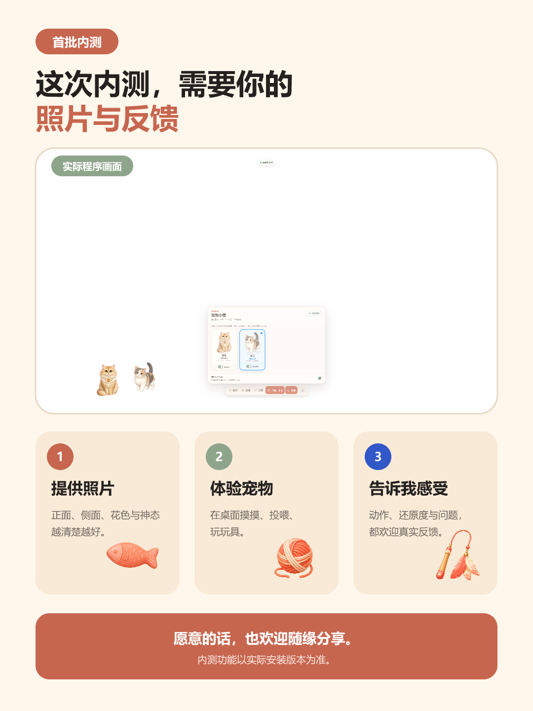

# Pet Desktop Companion · 通用桌面宠物运行器

把真实宠物带进电脑，但不把任何角色内容绑进安装包。Windows 用户先安装通用运行器，再分别导入宠物包和道具包；三者可以独立定制、升级、交付与售卖，用户无需 Codex。

> 从 `v0.2.0-alpha` 起，安装器本身不内置包包、菲菲或任何食物/玩具；`v0.3.0-alpha` 加入多宠物选择、分部位摸摸、窗口平台和亲密度养成。

[下载 Windows v0.3 Alpha](https://github.com/SharingYu/baobao-codex-pet/releases/tag/v0.3.0-alpha) · [Windows 使用指南](docs/user-guide.md) · [宠物风格目录](docs/pet-style-catalog.md) · [定制交付流程](docs/customization-workflow.md) · [内测宣传素材](marketing/DESIGN.md) · [产品 PRD](docs/universal-desktop-pet-prd.md)



<p align="center">使用真实 v0.3 程序截图与示例 petpack 资产制作的内测主视觉；运行器首次启动仍是空壳，包包、菲菲和起步道具需单独导入。</p>

## 三层交付

```text
Pet Desktop Companion（通用运行器）
  ├─ .petpack   一只真实宠物的动作图集、触摸区域与行为映射
  └─ .itempack  食物、玩具、藏身处等素材与受限行为
```

- 运行器负责透明桌面、点击穿透、窗口平台、物理互动、亲密度、存档、托盘与安全导入。
- 宠物包只包含声明式 manifest 和透明 PNG/WebP 动画图集。
- 道具包只包含声明式 manifest 和 PNG/WebP 素材；行为限定为零食、弹球、逗玩与藏身处，包内不能执行脚本。
- 用户可购买一只宠物、一个主题道具包，或单独替换任一内容包，而不必重装程序。

## v0.3 Alpha 已实现

- 空壳启动：未装宠物时不显示默认角色。
- 宠物小屋：用真实宠物缩略图卡片选择当前宠物、独立控制桌面显隐，并继续导入 `.petpack`。
- 多宠物：选择包包、菲菲单独或同时显示，并指定当前互动宠物。
- 两阶段摸摸：先进入手掌模式，再点击头、背、尾巴或身体，触发不同动画。
- 投喂和玩具：同一时间各只保留一件，可手动收起，也有 30–90 秒自动超时。
- 被动窗口平台：把宠物拖到普通 Windows 窗口顶边后自动吸附、行走、跟随和安全落下。
- 独立亲密度：摸摸、成功投喂和有效玩乐加分，五级成长解锁更多道具。
- 透明区域点击穿透；托盘可显示、隐藏、安静或可靠退出。

## 下载、安装与完整首次体验

1. 从 GitHub Release `v0.3.0-alpha` 下载安装器或便携版、两个示例 `.petpack`、`starter-play-kit.itempack` 和校验和文件。
2. 安装并打开 **Pet Desktop Companion**；首次启动是正常空壳状态。
3. 导入 `baobao.petpack`、`feifei.petpack` 与 `starter-play-kit.itempack`。
4. 打开互动条“选择宠物/当前：…”进入“宠物小屋”：点击宠物卡片设为当前互动宠物，用每张卡片的“桌面显示”开关控制单独或同时出现。
5. 依次体验分部位摸摸、投喂与取消、玩具与取消、窗口顶边行走、亲密度保存和退出重启。

公开 Alpha 暂未使用商业代码签名证书，Windows 可能显示 SmartScreen。请只从本仓库 Release 下载，并先核对 SHA-256：

```powershell
Get-FileHash .\PetDesktop-0.3.0-alpha-x64.exe -Algorithm SHA256
```

确认结果与 `SHA256SUMS-v0.3.0-alpha.txt` 一致后，可选择“更多信息”→“仍要运行”。完整操作见 [Windows 使用指南](docs/user-guide.md)。

## 互动与正确退出

- “摸摸”先把指针切换为手掌，再点击宠物的头、背、尾巴或身体；`Esc` 可取消。
- “投喂”和“玩具”菜单都能明确收起当前内容，切换道具也会替换旧道具。
- 把宠物拖到普通窗口顶边会自动进入平台行为，无需“边缘”按钮。
- “安静”会取消临时互动；单击系统托盘图标显示或隐藏宠物，右键可单独显示/隐藏互动条或退出。
- 隐藏不等于退出。请使用内容包管理区的“退出程序”，或右键托盘图标选择“退出”。

包包、菲菲和起步道具均是独立示例内容，不会随运行器安装。

## 打包与交付

### 宠物包

```powershell
node tools/petpack/convert-codex.mjs --input pets/my-cat --output petpacks/my-cat
node tools/petpack/cli.mjs validate petpacks/my-cat
node tools/petpack/cli.mjs pack petpacks/my-cat release/petpacks/my-cat.petpack
```

### 道具包

```powershell
node tools/itempack/cli.mjs validate itempacks/starter-play-kit
node tools/itempack/cli.mjs pack itempacks/starter-play-kit release/itempacks/starter-play-kit.itempack
```

两种导入器都会拒绝路径穿越、符号链接、Windows 保留路径、主动/可执行内容、超大文件、哈希不匹配和未声明资源。

## 窗口平台与隐私边界

只有在用户开启“窗口平台互动”时，v0.3 才会在本机运行 Windows watcher，并且只输出顶层窗口的 `hwnd / pid / left / top / right / bottom` 几何字段。关闭开关会立即停止 watcher、清空缓存并取消重启计时。运行器不会读取窗口标题、页面图像、网页 DOM、聊天或文档正文，不截屏、不 OCR、不使用 UI Automation，也不会上传几何或互动记录。

详细方案见 [窗口平台与隐私边界](docs/window-edge-scenes.md) 与 [定制交付流程](docs/customization-workflow.md)。

## 首批内测

首批内测用户可以免费定制一只专属桌面宠物。你提供清晰的正面、侧面、花色与神态照片，体验后告诉我动作、还原度和使用问题；愿意的话，也欢迎随缘分享到社交平台，不作强制要求。

<p align="center">
  
  
</p>

宣传图与[约 14 秒竖屏宣传视频](marketing/out/internal-test-video.webm)全部由真实 v0.3 程序截图、包包/菲菲 petpack 与起步道具包导出；来源与 SHA-256 记录在 [`marketing/out/manifest.json`](marketing/out/manifest.json)。客户定制前可先从 [S01–S04 风格目录](docs/pet-style-catalog.md)选择整套动作的统一视觉风格。

## 本地开发

需要 Node.js 22.12+ 与 pnpm 11.7+：

```powershell
pnpm install
pnpm check
pnpm dev
pnpm dist:win
pnpm dist:portable
```

```text
apps/desktop/electron   透明窗口、托盘、窗口几何 watcher、独立包导入与原子存档
apps/desktop/renderer   Canvas 动画、多宠物互动、养成与窗口平台
packages/pet-schema    .petpack v1 Schema、触摸区域与类型
packages/item-schema   .itempack v1 Schema、解锁等级与类型
tools/petpack          宠物转换、验证、打包和导入工具
tools/itempack         道具验证、打包和导入工具
petpacks               包包、菲菲独立宠物包示例
itempacks              独立道具包示例
```

## 隐私与授权

客户原始照片、视频、EXIF 和社交平台水印只应存在于私有制作目录，不能提交到公开仓库。交付包只含重绘的动画或道具资源与声明式配置。

代码、Schema、工具和起步道具包采用 [MIT License](LICENSE)。包包、菲菲的角色形象和动画资产采用单独的 [`LicenseRef-Personal-Display-Only`](LICENSES/LicenseRef-Personal-Display-Only.txt)，具体边界见 [NOTICE](NOTICE.md)。
