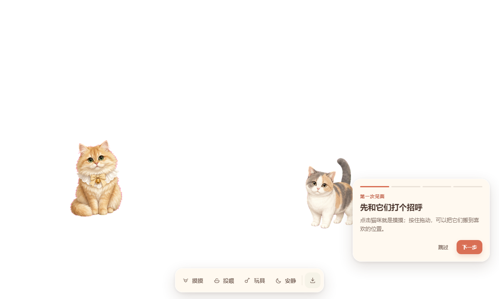

# 包包与菲菲 · 真实宠物桌伴

把你真正的宠物带进电脑。无需 Codex，Windows 用户安装后即可在桌面上摸摸、投喂、玩小球、挥逗猫棒或放一个纸箱；需要专注时，一键切换安静陪伴。

[下载 Windows Alpha](https://github.com/SharingYu/baobao-codex-pet/releases/latest) · [定制交付流程](docs/customization-workflow.md) · [产品 PRD](docs/universal-desktop-pet-prd.md)



## 这版已经能做什么

- 包包与菲菲同时生活在透明桌面层，可自主待机、走动和观察指针。
- 点击摸摸，按住拖动到喜欢的位置。
- 投喂小鱼干、冻干和罐罐；食物可直接拖到桌面。
- 小球会弹跳，宠物会追逐和扑击；另有逗猫棒与纸箱。
- 安静模式停止主动邀请，但宠物仍会陪伴。
- 空白区域点击穿透，不挡住正常工作；托盘始终可显隐或退出。
- 位置、安静模式和互动状态在本地保存，重启后恢复。
- 安全导入 `.petpack`，一套程序可承载不同客户的定制宠物。

核心定位是“真实宠物的无压力数字分身”：没有死亡、断签、强制饥饿或好感惩罚，互动用于表达性格，而不是制造负担。

## Windows 体验版

1. 从 [Releases](https://github.com/SharingYu/baobao-codex-pet/releases) 下载 `PetDesktop-0.1.0-alpha-x64.exe`。
2. 运行安装程序并启动 **Pet Desktop Companion**。
3. 通过底部操作条体验摸摸、投喂、玩具与安静模式。
4. 点击操作条右侧的导入图标，可安装定制 `.petpack`。

Alpha 安装包尚未购买商业代码签名证书，Windows SmartScreen 可能显示“未知发布者”。正式销售版必须签名。

## 从照片到客户桌面的闭环

```text
客户照片/视频
    → 角色与动作生成
    → 透明图集质检
    → Codex v2 / 通用 petpack 转换
    → 安全校验与打包
    → 客户在桌面程序中一键导入
    → 摸摸/投喂/玩具/存档验收
```

已有 Codex v2 宠物可以直接转换：

```powershell
node tools/petpack/convert-codex.mjs --input pets/my-cat --output petpacks/my-cat
node tools/petpack/cli.mjs validate petpacks/my-cat
node tools/petpack/cli.mjs pack petpacks/my-cat release/petpacks/my-cat.petpack
```

`.petpack` 是声明式 ZIP 容器。导入器会检查路径穿越、符号链接、Windows 保留路径、文件数量与体积、图片尺寸、SHA-256、未声明文件及主动/可执行内容；宠物包不能执行 JavaScript 或系统命令。

当前 Alpha 运行器只接受与 Codex v2 相同的 `192 × 208` 单格、`8 × 11` 图集与 16 个注视方向。其他合法布局会在导入时明确拒绝，避免“导入成功但显示错帧”；后续版本再切换为完全由 manifest 驱动的渲染。

## 同时支持 Codex 宠物

原始 Codex v2 包仍保留在：

- `pets/baobao`
- `pets/feifei`

复制到以下目录即可在 Codex 中选择：

```text
%USERPROFILE%\.codex\pets\
```

每只宠物包含 `1536 × 2288`、11 行动画图集和 16 个注视方向。

## 本地开发

需要 Node.js 22.12+ 与 pnpm 11.7+：

```powershell
pnpm install
pnpm dev
pnpm check
pnpm dist:win
```

项目结构：

```text
apps/desktop/electron   透明窗口、托盘、点击穿透、导入与原子存档
apps/desktop/renderer   Canvas 动画、互动、玩具与新手引导
packages/pet-schema    .petpack v1 JSON Schema 与 TypeScript 类型
tools/petpack          转换、验证、打包和导入工具
petpacks               通用宠物包示例
pets                   Codex v2 宠物包
docs                   PRD、架构和定制交付流程
```

详细安全边界与迁移思路见 [桌面程序架构](docs/desktop-architecture.md)。

## 隐私与授权

公开仓库只包含由宠物照片重新绘制的动画图集，不包含原始照片、私人视频、EXIF 或社交平台水印。客户素材应在私有工作目录处理，交付或退款后按约定删除。

代码与工具采用 [MIT License](LICENSE)。包包、菲菲的角色形象和动画资产采用单独的 [`LicenseRef-Personal-Display-Only`](LICENSES/LicenseRef-Personal-Display-Only.txt)，可随本项目个人、非商业使用，但不得再售、重新托管、训练模型或用于其他商业产品；具体文件边界见 [NOTICE](NOTICE.md)。
