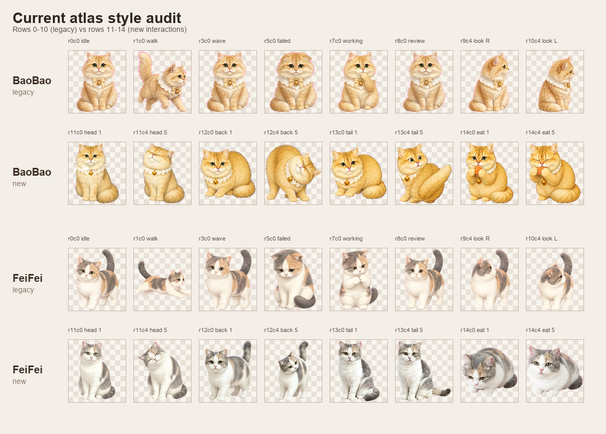

# Pet Desktop Companion 宠物动作套图风格目录

本文用于客户选型、生成提示词编排和美术验收。它回答三个问题：现有包包/菲菲图集为何看起来像混入了两代画风；客户可以选择哪些风格；生产时怎样锁住同一只宠物的身份、画风和动作帧。

## 结论先行

- 两套宠物包的技术规格一致：`1536×3120`、`8×15`、单格 `192×208`，锚点为底部中心。
- 旧行 `0–10` 是“柔和手绘绘本 Q 版”；新增互动行 `11–14` 更接近“半写实厚涂萌宠”。两者都可以作为独立产品风格，但不应在同一只宠物内混用。
- 包包与菲菲本身的毛色、毛长、配饰和体型差异属于**身份差异**，可以并存；旧行与新行之间的比例、材质、颜色和细节变化属于**风格漂移**，切换动作时会产生明显跳变。
- 默认生产风格推荐 **S01 柔和手绘绘本 Q 版**。如客户改选其他风格，应整套重做 15 行，而不是只重做新增动作。

## 图集与动作契约

| 行 | 状态 | 帧数/用途 |
| --- | --- | --- |
| 0 | `idle` | 6 帧，待机循环 |
| 1 | `running-right` | 8 帧，向右移动 |
| 2 | `running-left` | 8 帧，向左移动 |
| 3 | `waving` | 4 帧，打招呼 |
| 4 | `jumping` | 5 帧，跳跃/玩耍 |
| 5 | `failed` | 8 帧，失败/沮丧 |
| 6 | `waiting` | 6 帧，等待循环 |
| 7 | `running` | 6 帧，工作中循环 |
| 8 | `review` | 6 帧，检查/思考循环 |
| 9–10 | `lookDirections` | 16 个方向，间隔 `22.5°` |
| 11 | `pet-head` | 8 帧，摸头反应 |
| 12 | `pet-back` | 8 帧，摸背反应 |
| 13 | `pet-tail` | 8 帧，摸尾反应 |
| 14 | `eat` | 8 帧，进食反应 |

清单定义见 [`petpacks/baobao/manifest.json`](../petpacks/baobao/manifest.json) 与 [`petpacks/feifei/manifest.json`](../petpacks/feifei/manifest.json)。

## 当前两代风格的视觉诊断



### A. 旧行 0–10：柔和手绘绘本 Q 版

- 头身比偏 Q，眼睛较大，四肢较短，轮廓圆润；即使在跑、挥手或转向时也保持吉祥物感。
- 低对比、轻空气感的毛发边缘，局部细节被有意简化，缩到 `192×208` 仍然清楚。
- 包包的奶油金长毛、白色围脖、浅黄格纹蝴蝶结和单颗金铃铛都较稳定。
- 菲菲的白底、灰蓝与桃金色不对称色块较清楚，圆脸、短腿和高举的灰蓝尾巴保持稳定。

### B. 新行 11–14：半写实厚涂萌宠

- 身体更大、更接近真实猫体比例；头相对变小，四肢与躯干更修长或更厚重。
- 毛发明暗、体积和肌肉转折更强，姿态更写实；单帧好看，但与旧行连续播放时不属于同一造型系统。
- 包包明显更橙、更短毛、更圆胖；围脖/蝴蝶结/铃铛的结构和尺度弱化，部分帧像另一种项圈。
- 菲菲明显更灰、更冷，桃金色斑块减弱；脸部、眼睛比例和站姿更写实，`eat` 的低伏宽体姿态尤其改变占地轮廓。

### C. 可量化的跳变

对全部单格透明像素面积做只读统计后：

| 宠物 | 旧行平均可见像素 | 新行平均可见像素 | 变化 |
| --- | ---: | ---: | ---: |
| 包包 | 20,268 | 23,332 | `+15.1%` |
| 菲菲 | 18,571 | 19,741 | `+6.3%` |

这说明新增动作不只是姿势变化，角色在单格中的视觉体量也整体变大。技术 QA 能确认帧数、透明边缘、画布尺寸和色键是否合格，却不会自动发现“同一只猫变胖、变短毛、变冷色”这类身份/风格漂移，因此必须增加整图集视觉 QA。

## 为什么同一只宠物不能混用画风

动画播放器会在不同状态间直接切换。只要以下任一项改变，就会产生肉眼可见的“闪变”：

1. 头身比、眼睛大小、耳朵角度或身体占格比例变化；
2. 长毛变短毛、平涂变厚涂、边缘软硬或光源方向变化；
3. 固定花纹的位置、面积或左右关系变化；
4. 围脖、蝴蝶结、铃铛等标志配饰的结构、材质或佩戴方向变化；
5. 同一个动作序列内部的基线、锚点、朝向或镜头角度变化。

生产规则是：**一只宠物 = 一个 identity profile + 一个 style profile + 一个 atlas generation version。** 不同宠物可以选择不同风格；同一宠物若更换风格，必须重做全套 15 行并重新验收，不能把不同风格的动作行拼进同一 atlas。

## 面向客户的四种风格

| 编号 | 客户看到的名称 | 视觉特征 | 适合 | 主要风险 |
| --- | --- | --- | --- | --- |
| **S01** | **柔和手绘绘本 Q 版（默认）** | 柔和水粉/数字手绘、圆润 Q 比例、轻毛发、低对比 | 猫狗写实照片转桌宠、长期扩动作 | 需要严格锁定毛色与配饰 |
| S02 | 软萌毛绒玩偶 | 绒布/短绒材质、玩偶比例、轻缝线感 | 软萌、治愈、礼物化产品 | 容易把真实花纹简化过度 |
| S03 | 清爽平涂贴纸 | 干净色块、有限描边、极少明暗 | 小尺寸、低性能设备、强辨识 | 长毛和复杂花纹表现有限 |
| S04 | 精致 3D 潮玩 | 软塑/树脂、棚拍柔光、圆润 3D 体积 | 潮玩、收藏、服装系统 | 跨批次光照和材质最难保持 |

## 统一身份与帧约束

下列“硬锁模板”必须放在每一次生成请求的前部，四种风格都共用。花括号内容由客户资料和宠物建档表替换。

```text
[IDENTITY LOCK — highest priority]
Character: {宠物名}, {品种/体型/毛长}.
Preserve exactly across every row and every frame:
- head-to-body ratio, face width, muzzle length, ear shape/spacing;
- eye shape and exact iris color: {眼睛特征}; pink/dark nose: {鼻子特征};
- coat base color and exact location, size and left/right relationship of every marking: {不可变花纹};
- chest, paws, belly and tail color/shape: {胸爪腹尾特征};
- signature accessory geometry, material, color and wearing side: {标志配饰};
- the same age, body mass, silhouette and dominant handedness.
This must unmistakably be the same individual pet. Do not invent, omit, recolor,
mirror, swap sides, simplify or redesign any identity feature.

[ATLAS / FRAME LOCK]
Create one coherent horizontal animation strip for state {动作状态}, exactly {帧数} frames.
Every frame is designed for one 192×208 cell, full body visible, centered on the same
bottom-center anchor and baseline. Keep at least 18 px horizontal and 16 px vertical safe
margin after fitting. Keep character scale, camera, perspective, lighting and palette fixed.
Frames must show progressive readable motion, not near-duplicates; first and last frame
must transition cleanly according to {是否循环}. No cropped ears/paws/tail, no overlap
between frames, no text, labels, guides, border, shadow, glow, motion trail or detached effect.
Pure solid {色键，默认 #FF00FF} background only; no other object unless explicitly requested.
```

## 四种风格的精确 Style Lock 模板

使用方式：`统一身份与帧约束 + 选中的 Style Lock + 动作语义后缀`。同一宠物的所有行必须使用同一个 Style Lock 原文，不得临时改写媒介、光线或比例。

### S01 柔和手绘绘本 Q 版（默认）

```text
[STYLE LOCK S01 — SOFT STORYBOOK MASCOT]
Refined soft hand-painted digital storybook illustration, charming mascot design.
Cute rounded proportions: large expressive head and eyes, compact torso, short readable limbs.
Soft gouache-like color transitions, delicate restrained fur tufts, warm diffuse frontal light,
low-to-medium contrast, clean soft silhouette, subtle paper-soft finish.
Preserve realistic species anatomy only enough for recognition; prioritize the established
mascot silhouette and readability at 192×208. No photorealism, no anime, no hard cel shading,
no thick comic outline, no 3D render, no plastic or plush material, no style drift.
Locked palette: {主色}, {辅色}, {眼鼻色}, {配饰色}. Locked light: warm neutral, upper-front-left.
```

### S02 软萌毛绒玩偶

```text
[STYLE LOCK S02 — PLUSH TOY]
Premium handcrafted plush-toy interpretation of the same pet, designed as one consistent toy.
Rounded toy proportions, slightly oversized head, compact body, short stable limbs.
Uniform fine velboa / minky fabric, soft short fibers, subtle stitched seams only at natural joins,
embroidered-looking but faithful eyes and nose, warm diffuse studio light, matte finish.
Translate every real coat marking into the exact same sewn fabric panel shape and side; preserve
all signature accessories as miniature fabric/metal props with fixed geometry.
No living-animal fur rendering, no photoreal skin, no crochet, no clay, no glossy plastic,
no changing seam layout, fabric pile, lighting or toy proportions between frames.
```

### S03 清爽平涂贴纸

```text
[STYLE LOCK S03 — CLEAN FLAT STICKER]
Clean premium flat 2D character illustration with crisp color blocks and minimal controlled shading.
Rounded compact mascot proportions, consistent 3 px-equivalent dark-warm outline at final cell size,
two-tone shadow only, no texture noise. Convert coat markings into accurate stable vector-like shapes;
never merge, move or mirror them. High silhouette clarity and readable facial features at 192×208.
Use one fixed palette of at most {颜色数量，建议 8–12} colors: {色板}.
No watercolor, painterly strokes, realistic fur, gradients beyond the single shadow tone,
3D lighting, sketch lines, variable outline width or sticker border outside the character.
```

### S04 精致 3D 潮玩

```text
[STYLE LOCK S04 — DESIGNER TOY 3D]
High-end designer vinyl/resin toy of the same pet, one fixed production model across all frames.
Rounded collectible proportions, softly sculpted fur masses (not individual realistic hairs),
matte satin soft-vinyl material, subtle micro-roughness, large glassy but non-glowing eyes.
Exact painted marking masks and accessory geometry remain locked to the same 3D model.
Fixed orthographic-like camera, fixed focal length, fixed warm-neutral three-point softbox lighting,
fixed contact-free transparent silhouette; no floor and no cast shadow.
No photoreal animal, no plush fabric, no clay fingerprints, no changing material, lens, exposure,
light direction, model proportions or paint-mask placement between rows or frames.
```

## 动作语义后缀

把对应后缀接在提示词末尾。默认不把鼠标手掌、人的手、零食 UI 或玩具 UI 画进宠物帧；这些由程序叠加，宠物 atlas 只表现反应。

```text
pet-head, 8 frames, non-loop:
Invisible gentle touch on the top of the head. Sequence: notice → ears relax → head presses upward
slightly → eyes half-close → happiest closed-eye response → small content sway → release → return
to the original baseline pose. Do not draw a hand, cursor, hearts or impact marks.

pet-back, 8 frames, non-loop:
Invisible gentle stroke along the back. Sequence: notice → shoulders lower → back arches softly into
the touch → weight shifts forward → tail rises comfortably → content pause → release → return.
Keep paws grounded and the bottom-center anchor stable. Do not draw a hand or motion trail.

pet-tail, 8 frames, non-loop:
Invisible touch near the tail. Sequence: tail-tip twitch → glance toward tail → ears become alert →
one readable tail flick → brief cautious/surprised expression → settle → tail returns → neutral pose.
Reaction must be pet-safe and playful, never distressed. Do not draw a hand or detached effect.

eat, 8 frames, non-loop:
Food is supplied by the application overlay. Sequence: notice/smell → lower head → first bite → chew →
second chew → satisfied lick → raise head → return. Do not embed a bowl, food, crumbs or UI in the
sprite unless {道具是否烘焙进图集}=yes; if yes, the exact same prop design must persist in all frames.
```

其他基础动作同样要写清可观察的动作弧线。例如走路必须包含左右脚交替、身体轻微起伏和尾巴反向平衡；等待必须是微呼吸/眨眼而非八张近重复图；方向观察必须保持同一身体朝向规则，16 个方向的头部转角按 `22.5°` 递进。

## 默认生产方案

推荐把 **S01 柔和手绘绘本 Q 版**设为下单页默认项，原因是：

- 与包包、菲菲旧行的成熟视觉资产最接近，修复成本最低；
- 长毛、短毛、复杂三花和配饰都能保留，不像平涂会损失细节；
- 在 `192×208` 的桌宠尺寸中比半写实/3D 更清楚、更亲切；
- 未来增加服装、玩具和食物时容易保持同一品牌语言。

若要把现有包包/菲菲作为可售模板，建议下一轮只选择一个目标：要么按 S01 重做行 `11–14`，要么按另一风格重做全 15 行。不要继续在当前混合 atlas 上追加新动作。

## 生产验收清单

1. **身份拼图审查**：随机抽取每行 1 帧放在同一张图上，遮住动作名称后仍能一眼认出同一只宠物。
2. **旧/新行对照**：比较头身比、眼睛、毛色、花纹、配饰、身体占格和光向；任一项跳变即退回。
3. **动作连续性**：逐帧播放，确认存在准备、峰值、恢复，不接受八张近重复图。
4. **技术验证**：尺寸、帧数、纯色键、透明边缘、安全边距、锚点、manifest 哈希全部通过。
5. **整包回归**：安装 petpack 后依次触发待机、移动、观察、摸头、摸背、摸尾和进食，确认状态切换无换装、变色、变胖或闪位。

## 本次审计证据

- 只读视觉对照图：[`docs/assets/pet-style-catalog-comparison.png`](assets/pet-style-catalog-comparison.png)
- 包包技术 QA：本地 `hatch-pet` QA 报告（生成过程资料，未纳入公开仓库）。
- 菲菲技术 QA：本地 `hatch-pet` QA 报告（生成过程资料，未纳入公开仓库）。
- 统计来源：两个最终 atlas 的 120 个单格透明区域、包围盒、颜色与边缘特征；没有重生成或改写任何 atlas。
