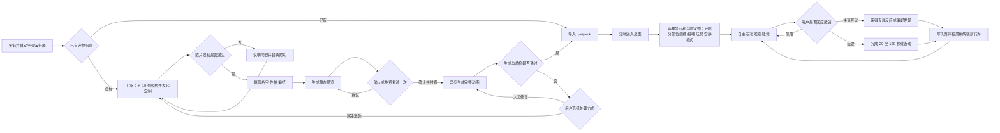

# Pet Desktop Companion MVP PRD

> 版本：v0.3｜日期：2026-07-16｜工作名：Pet Desktop Companion

## 1. 产品定义

一句话定位：**把用户真实的宠物带进电脑，成为一只会自己生活、逐渐了解主人、但永远不给主人压力的桌面伙伴。**

首发平台为 Windows 10/11，后续扩展 macOS。产品不依赖 Codex；Codex 宠物包作为可选导出能力，而不是使用前提。

首版交付形态：运行器是无内置宠物、无内置道具的空壳；每只定制宠物以独立 `.petpack` 安装包交付，道具以独立 `.itempack` 安装包交付。宠物制作服务可先采用付费试运营：用户确认静态预览后异步生成完整动画包。早期允许后台人工质检，但交付给用户的始终是可本地安装、可备份、可卸载的包。

核心用户：养宠人、异地或独居用户、长期使用电脑的学生与上班族，以及希望纪念或长期保存宠物形象的人。

用户任务：

- 我想在工作时看到“我自己的宠物”，并能把购买或定制的宠物包带到自己的电脑上。
- 我想随时摸它、喂它、陪它玩，但不想承担签到和养成压力。
- 我希望它有自己的性格，会产生让我意外的小动作和共同回忆。
- 我希望它陪伴但不遮挡、不打断工作。

## 2. 产品原则

1. **像本人**：毛色、花纹、脸型、眼睛、饰品和典型动作优先于功能数量。
2. **无压力**：无死亡、无断签、无强制饥饿、无掉好感、无负面通知。
3. **行为胜于聊天**：用动作、眼神、距离和选择表达性格；AI 对话只做可选配角。
4. **桌面原生**：理解窗口边缘、全屏、会议和安静时段，但不读取文件内容。
5. **本地优先**：宠物状态与偏好默认本地保存；上传素材可查看、导出和彻底删除。

## 3. 核心体验与用户流程

任一宠物首次成功进入桌面后，用户必须在 3 分钟内完成一次分部位摸摸、一次投喂、一次玩具互动，并知道如何取消临时道具、一键安静或退出；自定义宠物的异步等待时间不计入这 3 分钟。

异常与回访流程：

- 网络中断或退出应用后，生成任务在服务端继续；再次打开可查看进度。
- 两次预览仍不满意时允许取消；支付后生成失败则由用户选择人工修复或退款。
- 拒绝开机启动、通知或全屏检测权限不影响核心陪伴，相关能力以手动开关降级。
- 回访用户可以改名、修改用户声明的偏好、重置系统学习、重新生成、导出或彻底删除宠物数据。
- 用户可随时从空壳运行器进入“定制我的宠物”；已安装的其他宠物和道具不受影响。

## 4. 功能优先级

### P0：首版必须完成

| 模块 | 需求 |
|---|---|
| 内容包与安装 | 运行器不内置宠物或道具；验证、导入和移除独立 `.petpack` / `.itempack`；多宠物可选显示并切换当前互动对象；可卸载、备份、重新导入 |
| 宠物定制 | 照片本地质检；静态预览；一次免费重试；付费后异步生成；早期后台人工质检；失败修复或退款 |
| 基础生命感 | 走、跑、停留、观察、趴下、睡觉、被抱起；手掌模式命中头、背、尾巴或身体后给出不同反应 |
| 投喂 | 食物来自独立道具包；拖拽投喂；同一时间一份；可手动取消和自动超时；成功接受后增加当前宠物亲密度 |
| 玩具 | 玩具来自独立道具包；球、逗猫棒、猫窝等行为；同一时间一件；可替换、手动取消和自动超时 |
| 三层互动 | 后台陪伴、5 至 20 秒快速互动、30 至 120 秒主动玩耍 |
| 亲密与个性 | 每只宠物独立五级亲密度、每日计分上限和触摸冷却；等级解锁更多食物和玩具；不惩罚、不掉好感 |
| 羁绊相册 | 自动记录“第一次”和偏好发现；后续把数值等级转化为可回看的行为与共同记忆 |
| 桌面控制 | 拖动、置顶层级、普通窗口顶边被动吸附/行走/跟随/坠落、平台开关、托盘菜单、一键安静、暂时收起 |
| 工作保护 | 全屏时自动安静；会议模式首版为手动快捷键；不长期遮挡点击区域；只访问用户主动选择的安装包和应用自身数据目录 |
| 分享 | 一键保存透明 PNG、短 GIF 或回忆卡，默认不带私密桌面内容 |
| 存档与隐私 | 本地存档；素材删除入口；崩溃后恢复状态；明确的权限说明 |

P0 分三个可独立验收的里程碑：

1. **运行器 Alpha v0.3**：空壳运行器、宠物/道具包导入、多宠物选择、分部位摸摸、可取消投喂/玩具、五级亲密度、窗口顶边平台、安静与可靠退出、离线存档、性能基线。
2. **陪伴 Beta**：独立食物和玩具包、偏好学习、羁绊相册、分享导出和完整首次引导。
3. **公开 MVP**：照片质检、静态预览、支付、异步动画生成、人工质检、返工/退款和数据删除闭环。

### P1：验证留存后扩展

- 多宠物争玩具、分享食物、一起睡觉等组合行为。
- 多窗口之间的跳跃路线；若未来增加页面视觉理解，必须单独按应用授权并保持本地处理。
- 专注模式：宠物陪睡、计时结束庆祝，但不把待办事项变成养宠门槛。
- macOS 版本和跨平台皮肤包。
- 将试运营流程拆成“分钟级自动生成”和“人工精修”两种明确的商业档位。
- 更完整的羁绊相册、季节事件、房间与桌面小窝。

### P2：形成生态后再做

- 手机与手表组件、家庭设备同步。
- 好友宠物短暂拜访、交换礼物和回忆明信片。
- 创作者市场：动作、玩具、服装、房间和声音包。
- 可选的本地语音与轻量对话。
- 狗、兔、鸟等更多真实宠物品类。

## 5. 关键交互规则

### 投喂

- 食物是互动邀请，不是生命维持资源。
- 不展示焦虑型红色饥饿条；宠物可以用闻碗、望向食物柜等动作表达兴趣。
- 用户缺席后宠物不会生病或责备，只会产生“自己吃过饭”“等你回来时睡着了”等回忆。
- 每只宠物逐步形成口味档案，让身份差异来自行为，而不只是外观。

### 玩具

- 玩具有物理反馈，但不损坏、不消耗体力、不要求每日使用。
- 同一玩具根据性格出现追逐、埋伏、犹豫、无视、叼走、霸占等行为。
- 宠物有权主动结束游戏，避免变成完全服从的动画按钮。

教学状态例外：首次引导中的摸头、投喂和玩具必须保证响应，仅用于教会操作，不写入真实偏好。引导结束后恢复个性化反应。

### 状态优先级与邀请频率

- 状态优先级：退出/崩溃恢复 > 手动安静 > 全屏安静 > 首次教学 > 主动玩耍 > 快速互动 > 自主活动 > 睡眠。
- 每小时最多主动邀请 2 次；一次被忽略后至少冷却 20 分钟，不弹系统通知、不产生负面状态。
- 用户可以查看“已发现的偏好”，逐条纠正，或一键恢复为初始设定。

### 桌面行为

- P0 可在桌面地面或用户指定小窝休息；用户把宠物拖到普通窗口顶边后会自动吸附、行走和跟随，平台消失时安全下落。
- 输入和全屏时降低移动频率并静音；会议模式由用户通过快捷键开启。
- P0 不读取、不移动、不删除真实文件；文件彩蛋延后，且只能作用于虚拟副本或明确确认后的可恢复操作。

### 隐私与数据处理

- 首版照片生成使用云端服务；上传前在本地移除 EXIF、位置等元数据，全程加密传输和存储。
- 照片默认不用于模型训练；只有用户单独明确同意后才可进入改进样本。
- 成功交付或退款后 24 小时内删除活动存储中的源照片，备份副本最迟 30 天内清除；用户可随时发起立即删除。
- 人工质检默认只查看生成结果；只有用户选择“人工修复”时，授权人员才可查看源照片，并留下可见记录。
- 遥测只记录功能事件、性能和错误码，不记录截图、照片像素、文件名、文件内容或完整窗口标题。
- 窗口平台和全屏判断只使用本机窗口句柄、进程编号与几何矩形；不读取标题、正文、DOM、截图、OCR、UI Automation 或键盘输入；P0 不申请麦克风、摄像头、日历权限。

## 6. 留存与商业化

核心留存循环：**看到自主行为 → 接受一次可忽略邀请 → 获得专属反应 → 形成共同回忆 → 解锁新的行为组合。**

商业模式：

- 免费空壳运行器；宠物包和道具包各自独立安装、定制与售卖。
- 真实宠物自动生成：一次性付费。
- 人工精修与复杂饰品：高级一次性定制。
- 道具、动作、房间和季节主题：永久 DLC，可跨兼容宠物复用。
- 订阅仅用于云同步、家庭共享和生成额度，不锁住基础陪伴。
- 不出售续命、体力、补签、免饿或随机抽卡。

免费到付费路径：用户先安装空壳运行器，在“创建我的宠物”中免费获得一张带水印静态预览；确认形象后一次性付款生成独立 `.petpack`。可选道具以 `.itempack` 单独购买。交付与预览明显不符时提供一次返工，仍不通过则退款。

## 7. 首轮成功指标

- 首包激活时间：拿到 `.petpack` 后 60 秒内完成导入并进入桌面，成功率不低于 95%；未导入任何包时必须保持清晰的空壳引导。
- 生成漏斗：照片质检通过率、预览生成成功率和最终交付成功率分别不低于 80%、95% 和 95%。
- 创建转化：看到静态预览的用户中，至少 15% 完成一次性购买；付费订单 24 小时内交付率不低于 95%。
- 首日激活：以首次进入桌面的新用户为分母，至少 60% 在 24 小时内完成摸头、投喂和玩具互动。
- 留存假设：以首次进入桌面的自然日 cohort 计算，D7 留存达到 30%；通过第 7 日单题问卷验证主要价值是否为“像自己的宠物”和“动作有性格”。
- 分享信号：至少 10% 的首日激活用户在 7 天内导出过 GIF、透明图或回忆卡。
- 定制质量：交付后 5 分制问卷中，“像本人”均分不低于 4；返工率低于 15%，退款率低于 5%。
- 稳定性：无崩溃会话不低于 99.5%；空闲 CPU 平均低于 2%，常驻内存低于 200 MB。
- 低打扰：通过卸载/退出问卷和设置页反馈统计，因遮挡、噪声或性能问题关闭常驻的用户低于 5%。

## 8. 非目标与上线门槛

首版不做聊天机器人、社交广场、复杂家园、繁殖、战斗、排行榜、每日任务和开放式商城。

上线前必须满足：P0 无文件读写权限；一键安静和退出始终可用；长时间运行达到上述性能指标；无网络时基础陪伴完整可用；支付、生成失败、修复和退款链路可恢复；用户能够删除全部上传素材与生成数据，并收到删除完成状态。

首发传播主张：**“把你真正的宠物，带到每一台电脑上。”**
